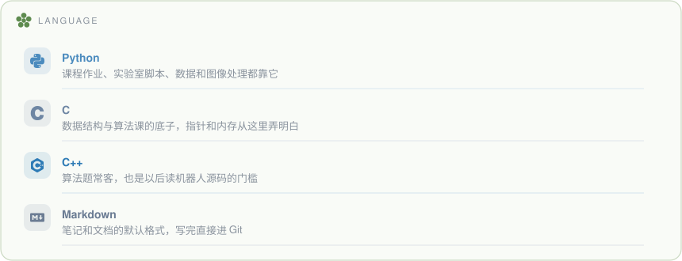
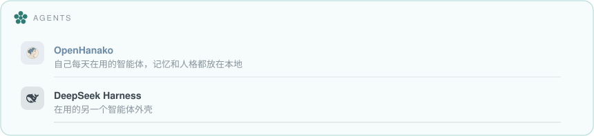
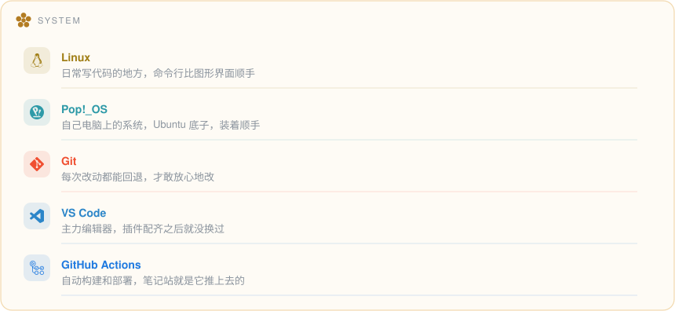
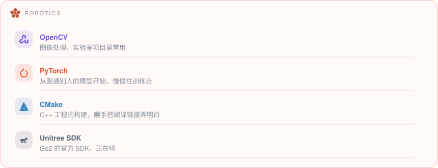
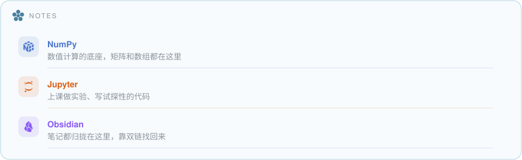

  <picture>
    <source media="(prefers-color-scheme: dark)" srcset="header-night.svg" />
    
  </picture>

  人工智能 · 中南民族大学 · 智能机器人实验室

 

<!-- ============ 工具箱 ============ -->

<!--CHIPS-->
   
 
    
 
  
 
     
 
    
 
   
<!--/CHIPS-->

🌱 &nbsp;<b>这些工具我拿来做什么</b> · what every chip actually is

 

<!--GUIDES-->
 
 
 
 
 

<!--/GUIDES-->

 

<!-- ============ 数据 ============ -->

<picture>
  <source media="(prefers-color-scheme: dark)" srcset="streak-night.svg" />
  
</picture>

  

<picture>
  <source media="(prefers-color-scheme: dark)" srcset="https://raw.githubusercontent.com/Lntano-S/Lntano-S/output/github-contribution-grid-snake-dark.svg" />
  
</picture>

 

<!-- ============ 我在做什么 ============ -->

## 现在

- **Go2 EDU 二次开发** — 在实验室把机器狗跑起来，边踩坑边整理成 [go2-edu-notes](https://github.com/Lntano-S/go2-edu-notes)
- **SCMU CS Wiki** — 和同学一起维护学院的开源学习资料：[SCMU-Wiki/cs-wiki](https://github.com/SCMU-Wiki/cs-wiki)
- **三本笔记** — [Python-note](https://github.com/Lntano-S/Python-note) · [cpp-note](https://github.com/Lntano-S/cpp-note) · [Linux-note](https://github.com/Lntano-S/Linux-note)
- **课程之外** — 数据结构、线代、概率论，慢慢把底子补厚

 

## 关于

中南民族大学人工智能专业 2025 级本科生，在智能机器人实验室做 Go2 EDU 的二次开发。

事情喜欢先理清楚再动手：学过的东西先记下来，笔记整理到别人也看得懂，才算真的学会。

 

<!-- ============ 页脚 ============ -->

  <picture>
    <source media="(prefers-color-scheme: dark)" srcset="garden-footer-night.svg" />
    
  </picture>

  

  横幅与页脚的天气、季节由 <a href="https://github.com/yuki4266/living-scene">living-scene</a> 每小时重画；徽章生成脚本在 <a href="tools">tools</a>。

